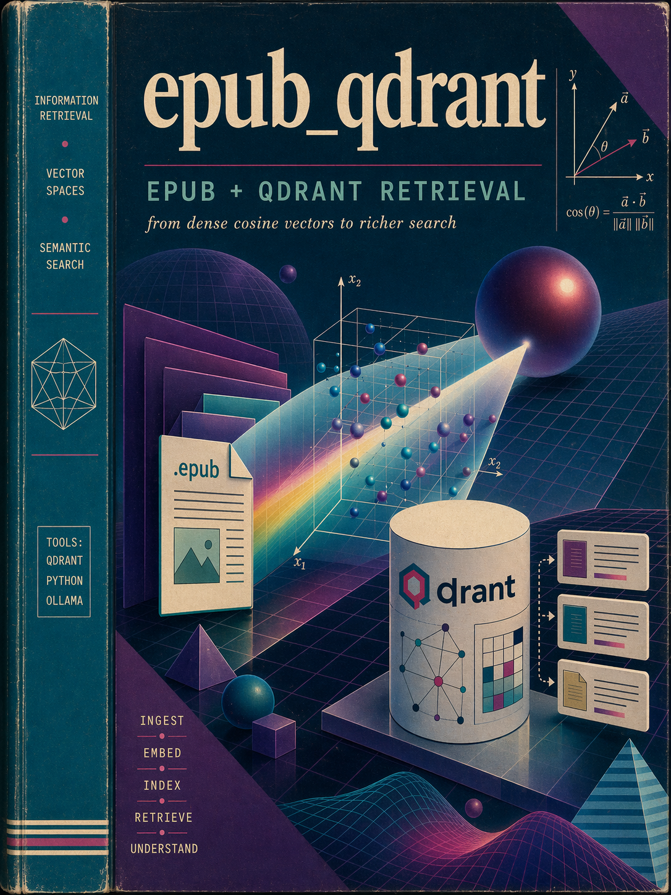

# EPUB & Paper-to-Qdrant Ingestion Pipeline

Reads EPUB files and PDF papers, generates embeddings, and stores vectors in **Qdrant collections** for hybrid (semantic + keyword) search.

## Roadmap
- [x] **Phase 0 — Z-score normalization** — fix cross-collection ranking immediately. No re-embedding needed. Scores from different collections live in different semantic spaces; z-score normalizes per-collection for fair cross-collection ranking.
- [x] **Phase 1 — LLM-as-judge pairwise pipeline** — set up evaluation using LLM judge to compare old vs new retrieval. No human-labeled test set needed. 30 designated queries, pairwise comparison, win rate target >60%, always track responses for future comparison. Fast (~15 min of LLM calls).
- [ ] **Phase 2 — MiniCOIL sparse re-embed + hybrid search** — store both dense (semantic) and sparse (keyword/metadata) vectors per point. ~96K points re-embed in minutes via ONNX/GPU. Fuse via Reciprocal Rank Fusion. Per-collection chunking (books = header-aware, papers = section-aware).
- [ ] **Phase 3 — LLM-driven metadata filter extraction** — scroll-discover distinct values on startup, map natural language to structured Qdrant filters, inject resolved metadata into retrieval prompts as scope context.


## Quick Start

```bash
# Install
pip install -e .

# Configure
cp .env.example .env
# Edit .env with your endpoints
```

## CLI Commands

```bash
# Ingest all EPUBs from a directory
epubq ingest ./books --collection books --limit 5

# Search a collection
epubq search "agentic AI patterns" --collection books --top-k 10

# List books/chunks in a collection
epubq list-books --collection books

# List/delete collections
epubq list-collections
epubq delete-collection books
```

## Directory Structure

```
src/                         # Core library
  __init__.py
  config.py                  # Settings from env vars
  ingestion/                 # PDF/EPUB parsing & chunking
    __init__.py
    epub_parser.py           # EPUB structure + text extraction
    chunker.py               # Header-aware paragraph chunking
    paper_loader.py          # PDF text extraction + paper chunking
    README.md
  embedding/                 # Embedding infrastructure (see servers/embedding_server/)
    __init__.py
    minicoil_server.py       # Legacy MiniCOIL server (superseded by unified embedding server)
    README.md
  storage/                   # Qdrant collection lifecycle
    __init__.py
    collections.py           # Create/delete/list/migrate collections
    upsert.py                # Upsert logic for EPUB & paper vectors
    scroll.py                # Paginated scroll helpers
    config.py                # Re-exports from src.config
    README.md
  cli/                       # CLI commands
    __init__.py
    main.py                  # epubq CLI entry point
    README.md

servers/                     # Standalone servers
  embedding_server/          # Unified embedding server (dense + sparse on one port)
    __init__.py
    server.py                # FastAPI app: /embed_dense, /embed_sparse, /health, /models
    embedder.py              # DenseEmbedder (embeddinggemma-300m) + SparseEmbedder (MiniCOIL)
    client.py                # Thin HTTP client: get_dense_vectors(), get_sparse_vectors()
    README.md
  mcp_server/                # Knowledge-base MCP server (Streamable HTTP)
    __init__.py
    server.py                # FastAPI server + MCP tool router
    retriever.py             # Retrieval layer: search, group, evidence
    llm_client.py            # LiteLLM streaming client
    config.py                # Server settings
    README.md

scripts/                     # One-off & pipeline scripts
  embed_papers_to_qdrant.py  # PDF papers → Qdrant
  embed_sparse_vectors.py    # Scroll + re-embed sparse vectors into -named collections
  test_hybrid_search.py      # Verify hybrid search (dense vs sparse vs RRF)
  evaluate.py                # LLM-as-judge evaluation harness
  compare_collections.py     # Collection comparison diagnostics
  diagnose_sparse.py         # Sparse vector diagnostics
  sweep_sparse_weight.py     # RRF sparse weight sweep
  sweep_single_book.py       # Per-book sparse weight tuning
  inspect_books.py           # Inspect book metadata

ai-agent-papers/             # Academic papers (markdown index)
downloads/                   # Downloaded PDFs + JSON metadata
test_books/                  # Test EPUB files
results/                     # Evaluation output (JSON)
docs/                        # Design docs
```

## Key Concepts

### Hybrid Search

Each point in `-named` collections stores **two vectors**:
- **dense** (768-d cosine): semantic similarity via embeddinggemma-300m on the unified embedding server
- **sparse** (IDF-weighted keyword): MiniCOIL sparse vector from [Qdrant/minicoil-v1](https://huggingface.co/Qdrant/minicoil-v1)

Results are fused at query time using **Reciprocal Rank Fusion (RRF)** for fair cross-collection ranking.

### Named Collections

| Collection | Vectors | Purpose |
|-----------|---------|---------|
| `books` | dense only | Original baseline (read-only reference) |
| `books-hybrid` | dense + sparse | Hybrid search target |
| `papers` | dense only | Original baseline (read-only reference) |
| `papers-hybrid` | dense + sparse | Hybrid search target |

### Architecture

```
Mac (dev)                              GPU Box (192.168.68.75)
┌─────────────────────────┐           ┌──────────────────────────┐
│ epubq ingest/books      │  Qdrant   │ Qdrant                   │
│ epubq search            │──────────▶│  books-hybrid            │
│ servers/mcp_server/     │           │  papers-hybrid           │
│   retriever.py          │           └──────────────────────────┘
└─────────────────────────┘
               │                      ┌──────────────────────────┐
               │  HTTP                │ Unified Embedding Server │
               └─────────────────────▶│   :8100                  │
      servers/embedding_server/       │  embeddinggemma-300m     │
             client.py                │  MiniCOIL (sparse)       │
                                      └──────────────────────────┘
```

## Configuration

### Required env vars

| Variable | Default | Description |
|---|---|---|
| `QDRANT_URL` | `http://192.168.68.75:6333` | Qdrant server URL |
| `QDRANT_COLLECTION` | — | Collection name for EPUBs |
| `QDRANT_PAPERS_COLLECTION` | `papers` | Collection name for PDF papers |
| `EMBEDDING_SERVER_URL` | `http://192.168.68.75:8100` | Unified embedding server URL (dense + sparse) |

### Optional env vars

| Variable | Default | Description |
|---|---|---|
| `CHUNK_SIZE` | `500` | Target tokens per chunk |
| `CHUNK_OVERLAP` | `100` | Token overlap between chunks |
| `VECTOR_SIZE` | `768` | Embedding vector dimensions |
| `DISTANCE` | `Cosine` | Vector distance metric |
| `PAPER_EMBED_ALL` | `0` | Set to `1` to embed all PDFs |

## The Machine(s) it Worked On
* M2 Pro Mac Mini
  * Local machine
  * Hosts the MCP server in dev for now
* GPU machine
  * RTX 5090
  * 128 GB DDR5
  * AMD Ryzen 9 7900X 12-Core Processor
  * Debian-based Linux


## Evaluation

```bash
# Run LLM-as-judge pairwise evaluation
python3 scripts/evaluate.py baseline
python3 scripts/evaluate.py phase_2_hybrid
```

## "Artwork"
